# Aria · Ariadne Transformer

<p align="center">
  
</p>

<p align="center">
  <strong>Optical interference · Pure JEPA latent prediction · First-class experience graph · Jointly inductive safety</strong>
</p>

<p align="center">
  <a href="https://crates.io/crates/aria-engine-core"></a>
  <a href="https://crates.io/crates/aria-engine-backends"></a>
  <a href="https://crates.io/crates/aria-engine"></a>
  <a href="LICENSE"></a>
</p>

---

Aria (Ariadne) is a transformer architecture that unifies next-token prediction, continuous diffusion, and latent world modeling inside a single state machine.
It replaces conventional electronic attention with optical interference, performs pure joint-embedding predictive modeling in latent space (no reconstruction in the core loop), and treats experience as a first-class typed graph that supports one-shot structural correction.
The design is grounded in an explicit discrete-state specification with inductive safety invariants for optical energy conservation, predictive contractivity, and graph integrity.

## Architecture

<p align="center">
  
</p>

Aria is **not a residual-stream Softmax transformer.** It is a formally specified **optical–JEPA–graph dynamical system** with exactly five named actions, four jointly inductive safety invariants, and a machine-checked TLA⁺ specification at its foundation.

```
Φ = Diff ∘ Match ∘ P ∘ U          Spec ≜ Init ∧ □[Next]_vars
```

### The four decisive differences

| Dimension | Mainstream Transformers | Aria |
|---|---|---|
| **Compute substrate** | Electronic QKᵀ matmul + Softmax | Optical unitary interference (𝔸4) |
| **State** | Residual stream + KV cache | Single triple ⟨ψ, z, G⟩ |
| **Prediction** | Reconstruct tokens / pixels | Pure latent JEPA — no decoder in core |
| **Formal guarantees** | Architecture diagram + loss function | Inductive invariants + TLA⁺ model check |

### The five named actions

| Action | Symbol | Mutates | Spec |
|---|---|---|---|
| **OpticalStep** | `O` | ψ | ψ′ = Uₜ(ψ); UNCHANGED ⟨z,G,t⟩ |
| **Predict** | `P` | z | z′ = P(I(ψ), aₜ); UNCHANGED ⟨ψ,G,t⟩ |
| **Match** | `M` | G | G′ = ED(G⊕z, G★); UNCHANGED ⟨ψ,z,t⟩ |
| **Diffuse** | `D` | z, t | z′ = Diff_G(z); t′ = t+1; UNCHANGED ⟨ψ,G⟩ |
| **Stutter** | `S` | — | UNCHANGED all (TLA stuttering) |

**Preferred Φ-cycle (𝐂4):** O → P → M → D

### The four safety invariants

Checked after every `apply`. Jointly inductive under Next.

| Invariant | Statement | Witness |
|---|---|---|
| **Inv1** | ‖ψ‖₂ = ‖ψ₀‖₂ — optical energy conserved | OpticalStep (exact unitarity) |
| **Inv2** | Res(ψ,z,t) ≤ prevRes + ε — predictive contractivity | Predict (ℙ2: 𝔼[Lip(P)] ≤ 1) |
| **Inv3** | GraphOK(G) — typed nodes/edges, embeddings in Z | Match (ℙ3: elementary edits) |
| **Inv4** | TypeOK — all state variables well-typed | Every action |

---

## Get started

### Install the CLI

```bash
cargo install aria-engine
```

### Run your first Φ-cycle

```bash
# 1,000-step OPMD run with default config
aria run --steps 1000 --schedule opmd

# Custom dimensions and export trace
aria run --steps 500 --n-modes 256 --latent-dim 64 --eps 1.0 --output trace.jsonl

# Optional Inv5–11 operating gates (monitors, never Spec enlargement)
aria run --steps 1000 --gates all --strict-gates

# Single-step control
aria step --action OpticalStep --n-modes 8 --latent-dim 16

# Invariant audit
aria check --state state.json --latent-dim 16

# Throughput across sizes
aria bench --n-modes 16,64,256 --steps 1000
```

### From Python

```bash
pip install maturin && maturin develop --manifest-path python/aria-py/Cargo.toml
```

```python
import aria

engine = aria.AriaEngine(aria.Config(n_modes=64, latent_dim=32, seed=42))
state = engine.step_phi(engine.init())      # O -> P -> M -> D
assert engine.check(state).all_ok

aria.run(steps=1000)                        # same numbers as `aria run`
```

### In the browser

```bash
./scripts/build_wasm.sh
python3 -m http.server -d www               # open http://localhost:8000
node www/parity.mjs                         # assert WASM == CLI
```

### As a Rust library

```rust
use aria_engine_core::prelude::*;
use aria_engine_backends::*;

let config = AriaConfig::default();
let engine = Engine::new(
    config,
    SimOptical::new(256),
    SimPredictor::new(256, 64),
    SimGraphBackend::new(64),
    SimDiffuser::new(64),
);

let state = engine.init(psi0, Graph::empty(), Condition::Token);
let state = engine.step_phi(state, Condition::Token)?;
let report = engine.check(&state, Condition::Token);
assert!(report.all_ok());
```

### Verify the TLA⁺ machine Spec

```bash
cd spec
java -cp tla2tools.jar tlc2.TLC -config AriaInstance.cfg AriaInstance
# 2026-08-09: 36049 states, 2616 distinct, Inv1–4 held (t ≤ 3)
```

### Run the test suite

```bash
cargo test --workspace                                  # 74 Rust tests
cargo clippy --workspace --all-targets -- -D warnings
./scripts/check_action_alphabet.sh                      # Σ has exactly 5 members

./scripts/build_wasm.sh && node www/parity.mjs          # WASM == CLI
pytest python/tests -q                                  # Python == CLI, and training
```

### Train the predictor on real data (Phase 3)

Real bytes — text, code, logs — become optical fields: a field is the **spectrum**
of a byte window, so interference between fields *is* window similarity. The
JEPA target is the embedding of the next window; there is no decoder anywhere
in the loop, and `Lip(P)` is projected onto its bound after every optimizer
step rather than merely penalised.

```bash
# Production path — real corpus
aria dataset --input corpus.txt --n-modes 64 --output data.json
python python/training/train_jepa.py --data data.json --latent-dim 64 --out weights.json
aria run --steps 1000 --predictor weights.json

# Synthetic phase ramps exist for smoke tests only (no --input warns you)
```

Trained on this repository's own documentation (153 KB of real text), the
quality gate output is:

```
holdout residual 0.887485 -> 0.362181 (decreased)
persistence baseline 0.645385 — model BEATS it
Lip(P) = 0.4291 <= 0.49 (P2 enforced)
```

Exit₃ is gated on two things, not one: the held-out residual must fall **and**
the model must beat "predict tomorrow = today" measured in the same latent
space. A model that cannot beat persistence has learned nothing.

---

## Crates

| Crate | Version | Purpose |
|---|---|---|
| [`aria-engine-core`](https://crates.io/crates/aria-engine-core) | 0.0.1 | State machine, Inv1–4, Inv5–11 gates, scheduler, config, traits |
| [`aria-engine-backends`](https://crates.io/crates/aria-engine-backends) | 0.0.1 | SimOptical, SimPredictor, TrainedPredictor, SimGraphBackend, SimDiffuser, shared runner |
| [`aria-engine`](https://crates.io/crates/aria-engine) | 0.0.1 | CLI — `run`, `step`, `check`, `bench`, `dataset` |
| `aria-engine-wasm` | 0.0.1 | wasm-bindgen surface for the browser |
| `aria-engine-py` | 0.0.1 | PyO3 extension — `import aria` |

All three user-facing surfaces call one function, `runner::run`, so parity is
structural rather than three implementations kept in step by hand.

---

## Repository

```
aria/
  assets/                     brand + architecture diagram
  crates/
    aria-core/                State, Action, Engine, Inv1–4, Inv5–11 gates, config
    aria-backends/            Operator implementations + the shared reference runner
    aria-cli/                 CLI binary
    aria-wasm/                wasm-bindgen surface
  python/
    aria-py/                  PyO3 extension
    training/train_jepa.py    JEPA training with Lipschitz regularization
    tests/                    parity + training tests
  www/                        browser demo + Node parity harness
  scripts/                    Σ alphabet gate, wasm build
  docs/                       Formal specification (reading order below)
    FORMAL_SPEC.md            Discrete Spec — axioms, actions, Next, Spec
    SAFETY.md                 Inv1–4 meanings and inductive arguments
    CONTINUOUS_REFINEMENT.md  Level 0–1 geometry + continuous prototypes
    RATIONALE.md              Why Aria is a different mathematical object
    TRACES.md                 W1–W7 accept, X1–X5 reject trajectory families
    ASYMPTOTICS.md            Asymptotic corollaries
    PERFORMANCE.md            Measured throughput + scaling (Phase 4)
    THEORIES.md               Empirical theories from validation
    VALIDATION.md             TLC + OPGROK evidence lineage
    evidence/                 Slim JSON receipts (v1–v3)
  spec/                       TLA⁺ machine Spec
    Aria.tla                  Full discrete Spec
    AriaMC.tla                Finite model instance
    AriaInstance.tla          TLC entry point
```

---

## Reading order

| You are a… | Start here |
|---|---|
| **Engineer** | [FORMAL_SPEC.md](docs/FORMAL_SPEC.md) → [SAFETY.md](docs/SAFETY.md) → code |
| **Formal methods researcher** | [FORMAL_SPEC.md](docs/FORMAL_SPEC.md) · [SAFETY.md](docs/SAFETY.md) · [spec/RUN.md](spec/RUN.md) |
| **ML researcher** | [RATIONALE.md](docs/RATIONALE.md) · [CONTINUOUS_REFINEMENT.md](docs/CONTINUOUS_REFINEMENT.md) |
| **Curious reader** | This page → [RATIONALE.md](docs/RATIONALE.md) → [FORMAL_SPEC.md](docs/FORMAL_SPEC.md) |

### Documentation map

| Document | Governs |
|---|---|
| [`FORMAL_SPEC.md`](docs/FORMAL_SPEC.md) | Discrete Spec: axioms 𝔸1–4, postulates ℙ1–3, corollaries 𝐂1–8, Next, Spec |
| [`SAFETY.md`](docs/SAFETY.md) | Inv1 energy · Inv2 contractivity · Inv3 graph · Inv4 TypeOK |
| [`CONTINUOUS_REFINEMENT.md`](docs/CONTINUOUS_REFINEMENT.md) | What U, P, Match, Diff mean continuously (non-Spec) |
| [`RATIONALE.md`](docs/RATIONALE.md) | Ontology: why not a Softmax residual-stream transformer |
| [`TRACES.md`](docs/TRACES.md) | W1–W7 accept families, X1–X5 reject families |
| [`PERFORMANCE.md`](docs/PERFORMANCE.md) | Measured throughput, scaling, and what the simulation does *not* evidence |

---

## Language stack

| Layer | Language | Role |
|---|---|---|
| Core runtime | **Rust** | Spec state machine, invariant enforcement, WASM, C/Python ABI |
| ML training | **Python** (PyTorch) | Learn P, I with Lipschitz regularization |
| Formal authority | **TLA⁺** | Executable specification of admissible behaviors |

---

## Status

| Area | State |
|---|---|
| Discrete Spec | **Frozen** — five actions, no enlargement |
| TLA⁺ / TLC | **Verified** — 36049 states, Inv1–4 held |
| Continuous annex | **Present** — Level 0–1 geometry |
| Phase 1 — reference engine | **Complete** — OPMD 1000-step green |
| Phase 2 — Python + WASM | **Complete** — CLI, notebook, and browser run the same schedule |
| Phase 3 — learning loop | **Complete** — held-out JEPA residual 0.842 → 0.116, Lip(P) ≤ 0.49 |
| Phase 4 — gates + backends | **Complete** — Inv5–11 toggles, backend swap, [performance documented](docs/PERFORMANCE.md) |
| Optical **hardware** backend | Not built — the trait is the seam; ℙ1's `O(log N)` is a substrate property the electronic simulation does not evidence |

---

## License

MIT OR Apache-2.0 — see the [License](#) file.

---

<p align="center">
  <sub>Build directive: Spec fidelity over trend-chasing. Four actions + Stutter. No decoder in the core loop. No fifth named action.</sub>
</p>
